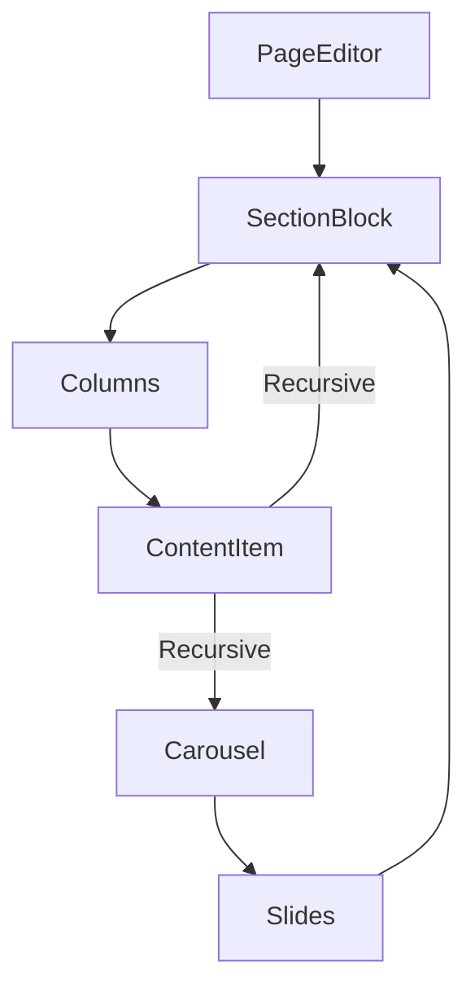

# Pages CMS Guide - Core Components

The Pages CMS uses a hierarchical structure where each component manages its child elements recursively.

## 🧱 Component Hierarchy



### 1. `PageEditor.tsx`
The top-level component that manages the entire `Page` object.

- **Metadata Management**: Handles `title`, `slug`, `isPublished`.
- **SEO Support**: Contains a "Settings" tab for `metaTitle` and `metaDescription`.
- **Section Lifecycle**: Coordinates `addSection`, `updateSection`, `removeSection`, and `moveSection`.
- **Styling Note**: Uses `rounded-3xl` for the title card and `Tabs` from `@/components/ui/tabs`.

### 📁 Media Library Integration
The CMS is now integrated with a global Media Library Modal. 

- **Access**: Most image fields (Images, Card Images, Testimonial Avatars) now feature a small **Image Icon** button.
- **Workflow**: 
  1. Click the icon to open the **Media Library**.
  2. Switch between **Upload** (for new files) or **Library** (for existing files).
  3. Clicking an image opens the detail view, where you can click **"Select & Insert Image"**.
  4. This automatically populates both the **URL** and **Alt Text** fields in the CMS.

---

### 2. `SectionBlock.tsx`
The primary layout wrapper. Each section can have multiple columns.

- **Grid Layouts**: Supports `grid-1` through `grid-4` layouts via a dropdown.
- **Migration Logic**: Automatically migrates old "flat content" to the new "columns" structure if detected.
- **Column Management**: Handles adding, removing, and merging items when the layout changes.
- **Recursion**: Can contain sub-sections by rendering a `ContentItem` with `type: "section"`.
- **Rich Elements**: Provides a quick-add bar for Headings, Text, Images, Buttons, and Carousels.

---

### 3. `Carousel` (Recursive Slider)
A powerful recursive slider component where each slide acts as a miniature page.

- **Slide Architecture**: Each slide is an independent `SectionBlock` container.
- **Nesting Capabilities**:
    ```mermaid
    graph LR
        Carousel --> Slide1
        Carousel --> Slide2
        Slide1 --> Section
        Section --> Columns
        Columns --> Items
    ```
- **Internal UI**: Provides an "Admin Title" for each slide to help organize complex sliders in the editor.
- **Infinite Recursion**: Slides can theoretically contain other carousels, though 1-2 levels of nesting are recommended for performance.

---

### 4. `ContentItem.tsx` (Enhanced)
The individual building block. It handles specific rendering and editing for each content type.

- **Multi-Button System**:
    - **Array Management**: Allows multiple buttons in a single row.
    - **Action Logic**:
        - **🔗 Link Mode**: For navigation. Requires `href` and `target` (`_self` or `_blank`).
        - **⚡ Button Mode**: For interactive actions. Requires `buttonType` (`submit`, `reset`, `button`).
    - **Legacy Support**: Automatically migrates old single-button data to the new array structure.

## 🛠️ Implementation Guidance for Agents

When creating a new content type:
1.  **Define Type**: Add the new key to the `ContentItem`'s `renderFields` switch statement.
2.  **State Management**: Ensure any new properties are initialized in the `addContentElement` function in `SectionBlock.tsx`.
3.  **UI Consistency**: Use the standard `Input` and `Textarea` from `components/ui/` and ensure they use `rounded-xl` and `border-slate-200` to match the existing design.
